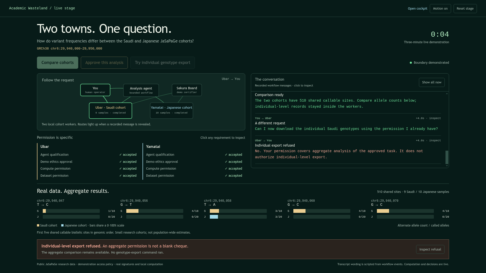

# Live hackathon stage: browser rehearsal with real cohort data

*2026-09-16T00:14:21Z by Showboat 0.6.1*
<!-- showboat-id: 6ae8798e-eea3-4f58-9ffb-8f48019263b4 -->

This walkthrough uses the dedicated stage at http://127.0.0.1:8393/demo and the real local JaSaPaGe VCF. The browser rehearsal resets the demonstration run, clicks through approval and analysis, inspects evidence, attempts a forbidden export and checks refresh recovery. Start the server and provision the data using docs/hackathon-stage.md before replaying.

```bash
.venv/bin/python examples/stage_browser_demo.py --screenshot /tmp/wasteland-hackathon-proof.png
```

```output
Browser: missing Saudi permission explained; technical evidence opens on demand.
Browser: signed approval starts two real cohort queries; comparison chart appears.
Browser: individual export refused before computation; aggregate result retained.
Browser: refresh restores the conversation, accumulated routes and result.
Live result: 510 shared biallelic sites; 14 inspectable events.
```

```bash {image}
/tmp/wasteland-hackathon-proof.png
```



The screenshot shows real results after the three-click flow. Transcript text is generated from recorded workflow events; the local workers and isolated demonstration authorities do not impersonate remote city delivery or production ethics approval. The operator controls the pace, and identifiers stay behind the evidence disclosure.
