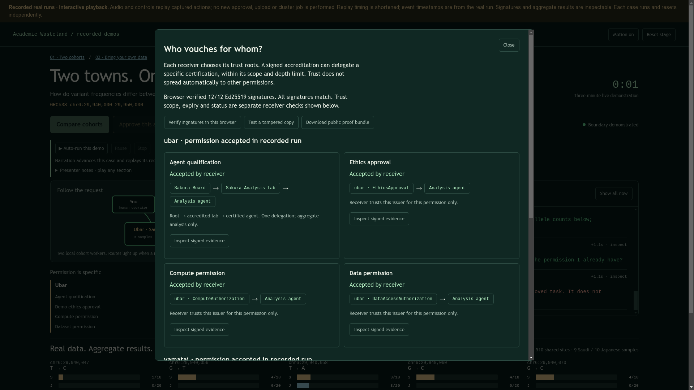

# Public narrated demos with verifiable trust and complete results

*2026-09-16T01:13:19Z by Showboat 0.6.1*
<!-- showboat-id: 4b917418-468a-499f-8ec0-b88b526cc504 -->

The public website is static playback of recorded real analyses, explicitly labelled. The local narrated auto-run was separately tested with a real DDBJ job, synchronized pause/resume and stop, independent resets, Ed25519 verification and tamper rejection, and complete aggregate downloads. This executable browser check exercises the deployed public site without starting new computation. Each verification uses a private browser session.

```bash
.venv/bin/python examples/public_replay_demo.py --screenshot /tmp/public-deployed.png
```

```output
Public cohorts: narrated playback, pause/resume, signature verification and all 510 rows passed.
Public visitor: independent playback and reset; three real recorded aggregate rows passed.
```

```bash {image}
/tmp/public-deployed.png
```


