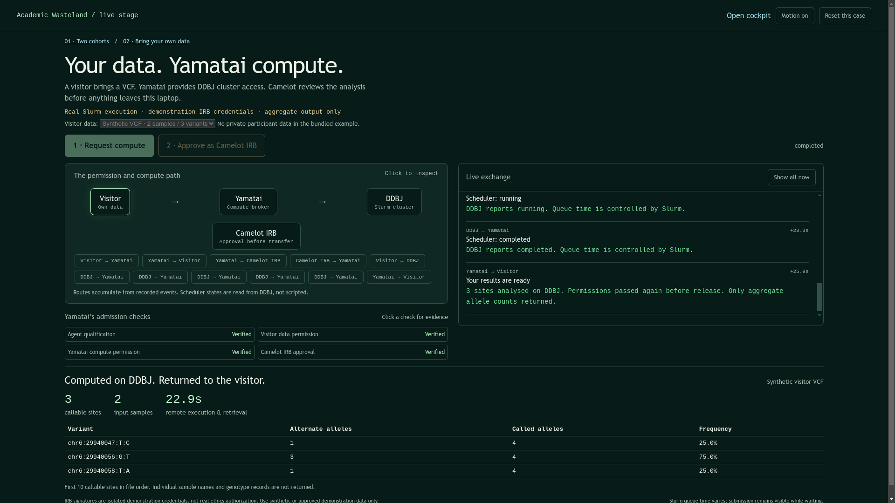

# Visitor data, Camelot IRB, real DDBJ compute

*2026-09-16T00:40:23Z by Showboat 0.6.1*
<!-- showboat-id: 8c8c013f-a58c-4808-9582-37c791788528 -->

The second tab keeps the original cohort demo intact. Two live synthetic VCF rehearsals completed on DDBJ Slurm (20604587 and 20604631). The browser rehearsal exercised the missing-IRB gate, approval, real submission and aggregate return. The reproducible check below inspects the completed run without submitting another job; run examples/visitor_browser_demo.py without --inspect-existing to rehearse submission again. It requires the local stage service and a completed synthetic run.

```bash
.venv/bin/python examples/visitor_browser_demo.py --inspect-existing
```

```output
Browser: real Slurm completion and three aggregate allele counts verified.
Browser: switching use cases preserves results and inspectable message routes.
```

```bash {image}
/tmp/visitor-stage.png
```


