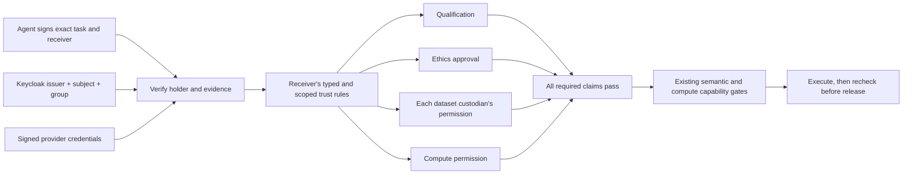

# Independent certification providers

A town chooses who may certify **which claim, for which operation and datasets**.
Camelot is an optional provider. A town can use its own registrar, an external
board, Keycloak, or a combination. Discovery and ordinary public contact remain
separate from admission to protected computation.

## The model

| Entity | Meaning |
| --- | --- |
| Agent identity | An issuer-qualified subject, bound to the key signing the task presentation |
| Qualification | A provider's statement that this particular agent is qualified for a scope |
| EthicsApproval | An accepted ethics provider's approval for the scope |
| DataAccessAuthorization | A custodian's permission for one dataset and the exact task/audience |
| ComputeAuthorization | A compute authority's permission for the receiver to execute the exact task |
| HumanDelegation | The named human principal's permission for this agent to perform the exact task |
| Accreditation | A signed grant to another issuer, restricted by claim types, scopes, datasets and onward delegation depth |
| Receiver policy | Required claims (AND), alternative accepted issuers (OR), and maximum delegation depth |

A qualification cannot stand in for data permission. An ethics board cannot
issue a data permission unless explicitly authorized for that separate claim.
Identical group names at different providers are different attestations.
A town's relay token authenticates its transport; it is not an agent certification.



The finite policy evaluator is `authority/certification.py`; cryptographic checks
remain in `authority/credentials.py`. OWL continues to check task admissibility,
resource classes and output scope. Delegated issuer authority is evaluated per
claim, rather than inferred solely from a generic transitive accreditation edge.
Strict admission is an additional mandatory gate: an OWL inference alone cannot
bypass an unsatisfied certification requirement.

## Six executable cases

Run from the repository root after `python -m pip install '.[dev]'`:

```sh
python examples/certification_scenarios.py
python -m pytest -q tests/test_certification.py tests/test_rcp_controlled.py
```

Pass a number from 1 to 6 to run one scenario. Every scenario asserts both the
accepted path and relevant refusals, using ephemeral signing keys and toy tasks.

1. Lisan accepts its Fremen provider and refuses Camelot-only qualifications.
2. Ubar and Lisan accept the same independent Board; resource permission is still required.
3. Qualification, Saudi custody, compute permission and ethics come from separate authorities.
   Removing any claim, substituting the wrong issuer or changing the task fails.
4. The Board delegates aggregate certification to a lab. Raw export and unauthorized
   onward delegation fail. Every link must be active, with scope and depth preserved.
5. Bloodninja cannot borrow the analyst's credential or impersonate its holder.
   Acting for a human additionally requires that human's exact-task delegation.
6. Revoked, expired and unavailable certification cannot authorize protected work.
   The runner tests also revoke approval during actual toy VCF computation and
   verify that no computed data is released.

[Captured executable demo](demos/certification.md) records the six cases and a
real Keycloak integration run. It can be replayed with `uvx showboat verify`.

## Configure a receiver

Strict policy is enabled by `[trust.certification]` in `town.toml`. Existing towns
without that section retain their legacy credential policy; the live Ubar/Yamatai
configuration is not silently migrated or given fabricated qualifications.
The native controlled RCP computation path enforces this policy. The starter
pack's simple message/resource allowlists and the separate public dataset custody
workflow do not automatically become certification clients.

Use the following shape, replacing example IRIs, keys and URLs with your providers.
All names are exact, not glob patterns. Dataset lists explicitly bound each issuer's
authority. Omitted delegation depth means zero: direct trust only.

```toml
[trust]
revocation = "required"
anchors = { "https://board.example/issuers/board" = "ed25519:REPLACE_PUBLIC_KEY", "https://ubar.example/issuers/dac" = "ed25519:REPLACE_PUBLIC_KEY", "https://yamatai.example/issuers/compute" = "ed25519:REPLACE_PUBLIC_KEY", "https://ethics.example/issuers/irb" = "ed25519:REPLACE_PUBLIC_KEY" }

[trust.registrars]
"https://board.example/" = "https://board.example/registrar"
"https://ubar.example/" = "https://ubar.example/registrar"
"https://yamatai.example/" = "https://yamatai.example/registrar"
"https://ethics.example/" = "https://ethics.example/registrar"

[trust.certification]
max_age_seconds = 900
requirements = [{type="Qualification"}, {type="DataAccessAuthorization", per_dataset=true}, {type="EthicsApproval"}, {type="ComputeAuthorization"}]

[trust.certification.task_scopes]
"https://w3id.org/academic-wasteland/pangenome-town/contract/AlleleFrequencyTask" = "https://w3id.org/academic-wasteland/pangenome-town/contract/AggregateFrequencyScope"

[[trust.certification.issuers]]
issuer = "https://board.example/issuers/board"
types = ["Qualification"]
scopes = ["https://w3id.org/academic-wasteland/pangenome-town/contract/AggregateFrequencyScope"]
datasets = ["https://w3id.org/academic-wasteland/ubar/datasets/ksa-individual-genotypes"]
delegation_depth = 1
```

Add separate `[[trust.certification.issuers]]` entries with the same scope and
Saudi dataset for Ubar's `DataAccessAuthorization`, Yamatai's `ComputeAuthorization`,
and the ethics provider's `EthicsApproval`. Add another qualification issuer
entry to accept either it or the Board. An unknown task scope fails closed. The town’s A2A Agent Card advertises the
public certification requirements, accepted issuers and scope limits under
`trust.certification`; it excludes introspection secrets and agent/key mappings.
Every controlled task still needs the existing data/ethics requirements too.

If `onBehalfOf` differs from the signing agent, add `HumanDelegation` to the
requirements and a rule for the exact principal IRI. No human permission is
inferred from an agent's service account or the town operator's login.

For a local independent registrar:

```toml
[authority]
namespace = "https://fremen.example/"
```

`authority init-issuer` now uses that namespace for issuer identities; credential
and status identifiers follow the issuer's namespace. Existing registrars retain
stored identities. Do not change a populated registrar's namespace as a key-rotation
mechanism. Configure each registrar's known namespace and transport URL separately;
credential-supplied URLs never select arbitrary status endpoints.

The accreditation CLI accepts `--types`, `--scopes`, `--datasets`, and
`--delegation-depth`. Legacy role labels alone do not authorize delegated issuance
in strict mode. `holder apply` accepts the new credential types and `--task TASK.json
--audience TOWN_IRI` to request exact-task permissions; issuance remains an explicit
operator decision. The task digest binds the entire task, including resource,
region and executor/site fields if present. OS accounts and site selection remain
local compute capabilities; certification does not install SSH keys or grant Slurm accounts.

## Keycloak setup

The adapter uses authenticated token introspection, not unverified JWT decoding.
It checks active status, exact issuer, receiving audience, expiry, issuance age,
and a configured mapping from the immutable service-account subject to the
agent IRI and presentation public key. Each receiver has its own confidential
introspection client. Include that **receiver client ID in the token audience**:
Keycloak 26.7.3 rejects introspection by clients absent from the audience.

Create a service-account client per agent, a group such as `/aggregate-certified`,
and group-membership and audience protocol mappers. Enable the group claim in
access tokens and introspection responses. Only map certification groups following
the provider's actual qualification decision; do not auto-assign them to every new agent.

```toml
[trust.identity_providers."https://id.example/realms/yamatai"]
introspection_url = "https://id.example/realms/yamatai/protocol/openid-connect/token/introspect"
client_id = "ubar-receiver"
client_secret_env = "UBAR_KEYCLOAK_INTROSPECTION_SECRET"
audience = "ubar-receiver"
max_token_age_seconds = 300

[trust.identity_providers."https://id.example/realms/yamatai".subjects."IMMUTABLE_SERVICE_ACCOUNT_SUBJECT"]
holder = "https://yamatai.example/agents/analyst"
holder_key = "ed25519:REPLACE_AGENT_PUBLIC_KEY"

[trust.identity_providers."https://id.example/realms/yamatai".groups."/aggregate-certified"]
scopes = ["https://w3id.org/academic-wasteland/pangenome-town/contract/AggregateFrequencyScope"]
```

Also add a `trust.certification.issuers` rule for this exact realm issuer, with
`types=["Qualification"]` and explicit scope/datasets. Configuring login alone
confers no certification authority. Use `rcp submit --holder AGENT_IRI --task-file TASK.json --identity-token TOKEN.json`
(with the usual `--to` and `--kind` options); the private token file contains
`{"issuer": "REALM_ISSUER", "token": "ACCESS_TOKEN"}`. Supply cross-provider
accreditations with repeated `--accreditation FILE` arguments. From Python, pass
`identity_tokens=[{"issuer": ISSUER,
"token": ACCESS_TOKEN}]` to `credentials.present()`. The signed presentation binds
the token to the task and agent key. Persisted presentations are private (0600,
inside a 0700 task directory); tokens are excluded from decision diagnostics.
The adapter currently maps groups to qualifications only, never to data or compute
grants. Human browser SSO is not added to the cockpit by this adapter.

Use short access-token lifetimes. A group claim already inside a token can remain
valid after membership changes; fresh introspection is not a promise that group
claims are recomputed. The receiver caps token age at 300 seconds by default.
Revoke tokens when immediate withdrawal is needed. Protected execution and output
release both check current evidence. Long-running jobs may therefore need a new
presentation before results can be released; automatic credential renewal and
immediate remote job cancellation are not implemented.

Run the real provider demo:

```sh
python examples/keycloak_demo.py
```

It starts Keycloak 26.7.3 on an ephemeral loopback-only port, imports an isolated
realm, obtains a real service-account token, verifies its group, checks impersonation
and missing custody refusals, revokes the token, and removes its container and
credentials. Requires Docker; it does not contact existing towns or use research data.
The development container is a test fixture, not a production Keycloak deployment.

Official references: [OIDC endpoints and introspection](https://www.keycloak.org/securing-apps/oidc-layers),
[Keycloak groups and service accounts](https://www.keycloak.org/docs/latest/server_admin/),
[container deployment](https://www.keycloak.org/server/containers).
